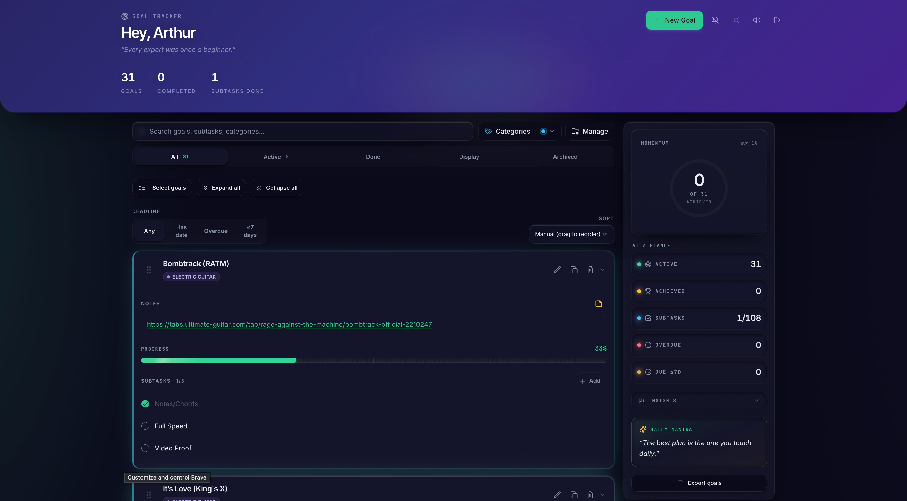

# Goal Tracker

A self-hosted, personal goal-tracking application.



Goal Tracker allows you to break goals down into weighted subtasks and track progress visually. It provides a structured approach to goal management without relying on third-party cloud services for data storage.

## Features

- **Weighted Subtasks:** Assign effort values to subtasks (1-5). The overall progress calculation adjusts based on the relative weight of completed tasks.
- **Visual Feedback:** Progress rings and completion states provide clear indicators of goal status.
- **Showcases:** Completed goals can store an external URL and an image for reference.
- **Due Dates:** Set deadlines on goals. The interface highlights overdue and upcoming deadlines.
- **Organization:** Categorize goals, drag-and-drop to adjust priority, and save structures as templates.
- **Keyboard Navigation:** A command palette (Cmd+K) allows quick navigation and actions.
- **Data Export:** Export your data locally to JSON, CSV, or PDF formats.

<video src="[YOUR_GITHUB_LINK_HERE](https://github.com/user-attachments/assets/c95f5168-aaca-4b49-beed-391ff5175676
)" autoplay loop muted playsinline width="100%"></video> 


## Tech Stack

**Frontend**
- React 18, Vite, TypeScript
- Tailwind CSS, shadcn/ui
- Framer Motion

**Backend**
- PocketBase (self-hosted SQLite database and REST API)

## Setup and Installation

Goal Tracker is a client-side React application that connects to a local PocketBase database. Data is stored entirely on your own machine.

### 1. PocketBase Setup

1. Download the PocketBase executable for your operating system from [pocketbase.io](https://pocketbase.io/docs/).
2. Extract the file to a preferred directory.
3. Start the database server:
   ```bash
   ./pocketbase serve
   ```
4. Navigate to `http://127.0.0.1:8090/_/` in your browser to create the initial admin account.

### 2. Database Collections

Configure the following collections in the PocketBase Admin UI. Ensure the API Rules for each restrict read/write access to `@request.auth.id = user.id`.

- **`categories`**: `user` (Relation to users), `name` (Text).
- **`goals`**: `user` (Relation to users), `name` (Text), `description` (Text), `archived` (Bool), `sort_order` (Number), `completed` (Bool), `category` (Relation to categories), `due_date` (Date), `emoji` (Text), `notes` (Text), `showcase_image` (File), `showcase_url` (Text), `showcase_caption` (Text).
- **`subtasks`**: `goal` (Relation to goals), `name` (Text), `completed` (Bool), `effort` (Number), `notes` (Text).

### 3. Frontend Setup

1. Clone the repository and install dependencies:
   ```bash
   git clone https://github.com/YOUR_USERNAME/goal-tracker.git
   cd goal-tracker
   npm install
   ```

2. Configure environment variables:
   ```bash
   cp .env.example .env
   ```
   Verify that `VITE_POCKETBASE_URL` is set to `http://127.0.0.1:8090`.

3. Start the development server:
   ```bash
   npm run dev
   ```

4. The application will be running at `http://localhost:3000`.

## Security Notes

The `VITE_POCKETBASE_URL` is bundled into the frontend code. Access control is handled by the PocketBase API rules. The `.gitignore` file excludes `.env` and `pb_data` directories to prevent accidental commits of local database files and environment configurations.
